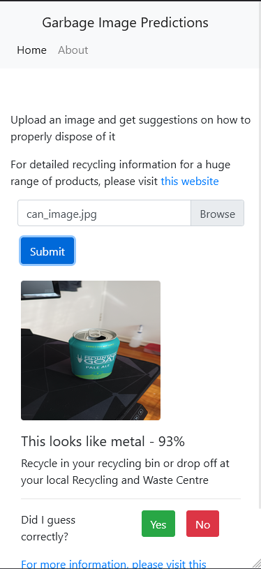

# flask_garbage

## App setup

Create virtual environment and install dependencies
```
virtualenv venv
source venv/scripts/activate
pip install -r requirements.txt
```

Create a .env file with a SECRET_KEY field

Run the server
```
python run_server.py
```

## App Structure

run_server.py handles the running of the app. The initial start up of the app will take some time as it needs to load the prediction model.
model_utils.py allows the prediction model to stay loaded throughout the app lifetime

config.py is where the prediction classes and model file are defined

routes.py handles the routes for the site

The controllers directory contains the business logic for the website. 

controllers/prediction_controller.py is where the majority of work is done for the app

the static folder is where uploaded images are held. Reported images are moved to either static/good or static/bad depending on the feedback given by the user

## Screenshots


The app is responsive and can be used on mobile devices comfortably


